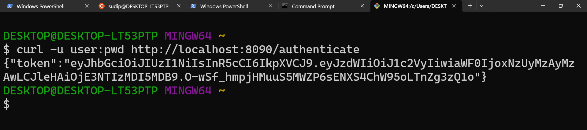

# 🔐 JWT Authentication Service - Spring Boot

This project is a simple Spring Boot application that demonstrates how to implement JWT (JSON Web Token) based authentication using **Basic Auth** credentials and the **Auth0 Java JWT** library.

---

## 🚀 Features

- Basic authentication using `curl` (`-u user:pwd`)
- Generates JWT on successful authentication
- Token includes:
    - Subject (username)
    - Issue time
    - Expiry time (10 minutes)
- No database or user persistence — credentials are hardcoded or configured via `application.properties`

---

## 🛠 Technologies Used

- Spring Boot 3.5.3
- Spring Security 6.x
- Java 21
- Auth0 `java-jwt` (v4.4.0)
- IntelliJ IDEA Ultimate
- Maven

---

## 📁 Folder Structure

```bash
src/main/java/com/cognizant/jwt_auth
│
├── config/
│ └── SecurityConfig.java # Spring Security configuration
│
├── controller/
│ └── AuthController.java # REST controller for /authenticate
│
├── util/
│ └── JwtUtil.java # JWT generation logic
│
└── JwtAuthApplication.java # Spring Boot main class
```


---

## 🔑 Authentication Flow

1. **Client** sends request with basic credentials:
```bash
   curl -u user:pwd http://localhost:8090/authenticate
```

2. **Server** decodes Authorization header and verifies credentials.

3. On success, a JWT is returned:
```bash
{
  "token": "eyJhbGciOiJIUzI1NiJ9..."
}

```


## 🧪 Test the Endpoint

**🟢Used Git Bash / CMD**

```bash
curl -u user:pwd http://localhost:8090/authenticate
```

### Screenshot 




## Codes

### JwtUtil.java

```java     

package com.cognizant.jwt_auth.util;

import com.auth0.jwt.JWT;
import com.auth0.jwt.algorithms.Algorithm;
import org.springframework.stereotype.Component;

import java.util.Date;

@Component
public class JwtUtil {

    private static final String SECRET_KEY = "Cognizant-SECRET";
    private static final long EXPIRATION_TIME = 10 * 60 * 1000; // 10 minutes

    public String generateToken(String username) {
        return JWT.create()
                .withSubject(username)
                .withIssuedAt(new Date())
                .withExpiresAt(new Date(System.currentTimeMillis() + EXPIRATION_TIME))
                .sign(Algorithm.HMAC256(SECRET_KEY));
    }
}


```

### SecurityConfig.java 

```java     
package com.cognizant.jwt_auth.config;

import org.springframework.context.annotation.Bean;
import org.springframework.context.annotation.Configuration;
import org.springframework.security.config.annotation.web.builders.HttpSecurity;
import org.springframework.security.web.SecurityFilterChain;

@Configuration
public class SecurityConfig {

    @Bean
    public SecurityFilterChain filterChain(HttpSecurity http) throws Exception {
        http
                .csrf(csrf -> csrf.disable())
                .authorizeHttpRequests(auth -> auth
                        .requestMatchers("/authenticate").permitAll()
                        .anyRequest().authenticated()
                );

        return http.build();
    }
}

```

### AuthController.java

```java     
package com.cognizant.jwt_auth.controller;


import com.cognizant.jwt_auth.util.JwtUtil;
import jakarta.servlet.http.HttpServletRequest;
import org.springframework.beans.factory.annotation.Autowired;
import org.springframework.web.bind.annotation.*;

import java.nio.charset.StandardCharsets;
import java.util.Base64;

@RestController
public class AuthController {

    @Autowired
    private JwtUtil jwtUtil;

    @GetMapping("/authenticate")
    public TokenResponse authenticate(HttpServletRequest request) {
        String authHeader = request.getHeader("Authorization");

        if (authHeader == null || !authHeader.startsWith("Basic ")) {
            throw new RuntimeException("Missing or invalid Authorization header.");
        }

        // Decode credentials
        String base64Credentials = authHeader.substring("Basic ".length());
        byte[] decodedBytes = Base64.getDecoder().decode(base64Credentials);
        String decoded = new String(decodedBytes, StandardCharsets.UTF_8);

        String[] credentials = decoded.split(":", 2);
        String username = credentials[0];
        String password = credentials[1];

        // Dummy user check
        if ("user".equals(username) && "pwd".equals(password)) {
            String token = jwtUtil.generateToken(username);
            return new TokenResponse(token);
        } else {
            throw new RuntimeException("Invalid credentials");
        }
    }

    record TokenResponse(String token) {}
}

```